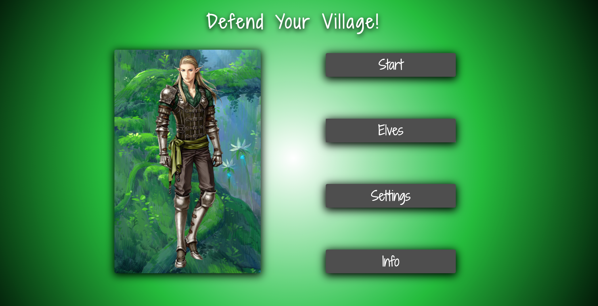
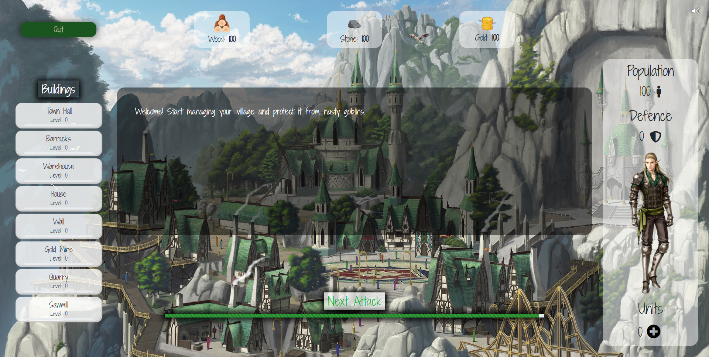

# Village-Defence

Available at [Village-Defence](https://hoolek77.github.io/village-defense/)

[]()

## Main page

[]()

## Running the application

```bash
git clone https://github.com/pdybowski/village-defense.git
npm install #to install all the dependencies
npm start #to build and run the app on localhost
```

## Built with

- HTML/CSS/TS

## Tools used

- TypeScript
- Babel
- Webpack
- Prettier
- Github Pages
- Cypress
- Jest

## Authors

- [Piotr Dybowski - Mentor](https://github.com/pdybowski)
- [Bartosz Białecki - Tech Lead](https://github.com/bartoszbialecki)
- [Ireneusz Bednorz - Prodcut Owner](https://github.com/ibednorz)
- [Szymon Kin - Development Manager](https://github.com/hoolek77)
- [Aleksandra Jankowska - Developer](https://github.com/aleksandraj036)
- [Jakub Góra - Developer](https://github.com/GoraJakub)

## Project status

In progress
